# Doc5 architecture

Doc5 is a hexagonal (ports-and-adapters) service. The domain core is pure standard library:
it knows nothing about Google Cloud, ADK or FastAPI. Every external capability is a
`typing.Protocol` port, and each port has four interchangeable adapter families: `gcp`
(managed services), `local` (a WORKING SDK-free offline stack, the dev / test default),
`platform` (HTTP clients to the shared horizontal-platform services), and `onprem`
(SDK-free fail-fast placeholders, the Google Distributed Cloud migration target). Switching
the whole stack is a one-line change of `profile`.

## Hexagon

```mermaid
flowchart TB
  subgraph Inbound["Inbound adapters (wiring)"]
    API["FastAPI (api/app.py)"]
    CLI["Typer CLI (cli/main.py)"]
    AGENT["ADK root agent (agent/root_agent.py)"]
  end

  subgraph Core["Domain core (pure stdlib)"]
    SVC["LoanDocService (orchestration)"]
    CV["CrossValidator (deterministic checks)"]
    IV["IncomeVerificationService (verdict)"]
    POL["LoanReviewPolicy (maker-checker)"]
    MODELS["models, prompts, serialization"]
  end

  subgraph Ports
    EXT["DocumentExtractionPort"]
    LLM["LLMPort"]
    SAFE["GuardrailPort, PIIRedactionPort"]
    OBS["AuditSinkPort, ObservabilityTracerPort"]
    GOV["AgentRegistryPort, ToolCatalogPort, EvaluationGatePort"]
    IDN["IdentityPort (server-verified Principal)"]
  end

  subgraph GCP["adapters/gcp"]
    DAI["Document AI"]
    GEM["Gemini (google-genai)"]
    MA["Model Armor"]
    DLP["Sensitive Data Protection (DLP)"]
    LOG["Cloud Logging WORM"]
    TR["Cloud Trace (OTel)"]
    EV["Gen AI eval service"]
  end

  subgraph LOC["adapters/local (SDK-free, offline)"]
    LPARSE["local document parser"]
    LLLM["deterministic generator"]
    LSAFE["heuristic guardrail, regex DLP"]
    LAUD["append-only SQLite audit, no-op tracer"]
    LGOV["in-process registry, catalog, offline eval"]
  end

  subgraph PLAT["adapters/platform"]
    Hrz1["Hrz1 guardrail and redact"]
    Hrz3["Hrz3 registry"]
    Hrz4["Hrz4 eval gate"]
    Hrz5["Hrz5 audit"]
  end

  subgraph ONP["adapters/onprem"]
    STUB["SDK-free fail-fast placeholders"]
  end

  API --> SVC
  CLI --> SVC
  AGENT --> SVC
  SVC --> CV --> IV --> POL
  SVC --> EXT & LLM & SAFE & OBS
  EXT --> DAI & LPARSE & STUB
  LLM --> GEM & LLLM & STUB
  SAFE --> MA & DLP & LSAFE & Hrz1 & STUB
  OBS --> LOG & TR & LAUD & Hrz5 & STUB
  GOV --> EV & LGOV & Hrz3 & Hrz4 & STUB
```



## Processing pipeline (full R1 safety)

The sequence below is the `/v1/process` path. Redaction runs first (P-04), the LLM only
normalises and explains, and the deterministic `CrossValidator` owns every verdict. Every
interaction is written to the WORM audit sink already redacted.

```mermaid
sequenceDiagram
  autonumber
  actor U as Underwriter
  participant API as FastAPI
  participant SVC as LoanDocService
  participant RED as PIIRedactionPort
  participant GR as GuardrailPort
  participant EXT as DocumentExtractionPort
  participant LLM as LLMPort
  participant CV as CrossValidator
  participant AUD as AuditSinkPort

  U->>API: POST /v1/process (application, documents)
  API->>API: resolve verified Principal (IdentityPort; body actor ignored)
  API->>SVC: process(applicant, documents, actor=principal.actor)
  SVC->>RED: redact(inputs)
  RED-->>SVC: de-identified text
  SVC->>GR: screen INPUT
  alt blocked
    GR-->>SVC: not allowed
    SVC->>AUD: record BLOCKED (redacted)
    SVC-->>API: blocked case, human review
  else allowed
    GR-->>SVC: allowed
    loop each document
      SVC->>EXT: extract(document)
      EXT-->>SVC: DocumentExtract
      SVC->>RED: redact extract fields
    end
    SVC->>LLM: normalise into IncomeFigure list
    LLM-->>SVC: figures (model never decides)
    SVC->>CV: validate(extracts, applicant)
    CV-->>SVC: CrossValidationResult (deterministic verdicts)
    SVC->>GR: screen OUTPUT
    GR-->>SVC: allowed
    SVC->>AUD: record ALLOWED or ESCALATED (redacted)
    SVC-->>API: LoanApplicationCase, requires human review
  end
  API-->>U: cited income verification
```

## Key invariants

- **Domain purity.** Nothing under `domain/` imports google-cloud, ADK, httpx, pydantic or
  FastAPI. The contract test and the offline gate prove the `local` and `onprem` profiles
  are SDK-free.
- **A working offline profile.** The `local` family runs the whole pipeline on a laptop with
  no Google Cloud, no API key and no emulator: a local document parser, a deterministic
  schema-driven generator, a heuristic guardrail, regex DLP, an append-only SQLite audit and
  in-process session/memory/registry stores. It self-seeds a tiny synthetic application so
  the CLI returns a real cited verification offline. The default `local` path imports no
  `google-cloud-*` package; optional `*_EMULATOR_HOST` opt-ins import the google client
  lazily, only on that branch.
- **Lazy GCP imports.** Every adapter under `adapters/gcp/` imports its SDK inside methods
  or under `TYPE_CHECKING`, never at module top level, so importing any module is safe with
  no Google Cloud SDK installed.
- **Deterministic verdicts.** The `CrossValidator` owns every PASS / WARN / FAIL; the LLM
  may explain a check in prose but can never change its status.
- **PII never leaves redacted.** Redaction runs before extraction output, the model prompt,
  the guardrail and the audit sink; trace spans carry no message content.
- **Always human-reviewed.** Every `LoanApplicationCase` is `requires_human_review = True`:
  the underwriter is the checker (P-06).

## Kernel and vertical boundary

`domain/kernel.py` is the stable evidence, model-boundary, safety, redaction, audit, and
agent-discovery seam. Applicants, loan documents, income verification, and cross-validation
are the replaceable lending vertical. A fork keeps the kernel and ports while replacing
those vertical artifacts.
