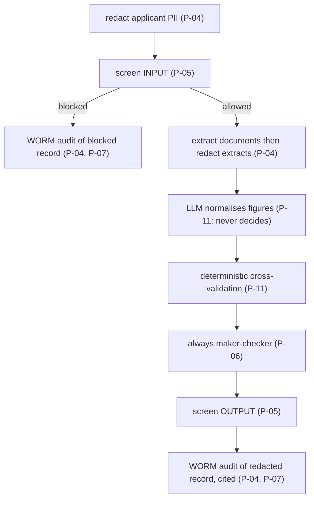

# Compliance : principle-to-control mapping

This document maps **every** GRC General Principle (**P-01..P-12**) and platform dependency
rule (**R1..R6, R8**) to the concrete control that enforces it in *this* repo : a file, an
adapter, a config value, or a Terraform resource. It is the auditor's index: each row points
to where the control actually lives, not a policy statement.

> Scope note: this is a reference build. The mappings below show *how the architecture
> enforces each principle*; a production deployment still needs your own legal, security and
> model-risk sign-off. All applicant data in this repo is synthetic and fictional.

Paths are relative to the repo root. Ports live under `src/loan_doc_intel/ports/`; adapters
under `src/loan_doc_intel/adapters/`; domain under `src/loan_doc_intel/domain/`.

---

## A. General Principles (P-01..P-12)

| Principle | Statement | Concrete control in this repo | Where |
|-----------|-----------|-------------------------------|-------|
| **P-01** | Data residency / sovereignty : keep regulated data in-country | **PARTIAL, and the gap is Document AI.** Region pinned to `asia-southeast1` for every service except extraction; regional DLP / Model Armor endpoints; VPC-SC perimeter; Terraform region validation fails fast. **Document AI reaches `asia-southeast1` only once Google grants single-region access**, so the processor and the adapter both default to the `us` MULTI-REGION and applicant document content is parsed in the United States. `us` names one jurisdiction; it is not `global`. Set `docai_location` and `LOAN_DOC_DOCAI_LOCATION` to `asia-southeast1` together the day access lands, and keep `gcp.resourceLocations` wide enough for whichever is chosen | `config/settings.yaml` (`region`, `document_ai.location`), `Settings.region`, `infra/terraform/variables.tf` (`docai_location`, `resource_location_values`), `infra/terraform/document_ai.tf`, `infra/terraform/vpc_sc.tf` |
| **P-02** | No vendor lock-in : ports & adapters, swappable backends | Protocol ports bound by dotted path; one-line `profile` switch across four families (`gcp` / `local` / `platform` / `onprem`); the SDK-free `local` family proves the whole domain runs off-cloud, and the `onprem` placeholder family satisfies every Protocol | `src/loan_doc_intel/ports/*`, `config.py` (`Container`), `config/settings.yaml` (`adapters:`), `adapters/local/*`, `adapters/onprem/*` |
| **P-03** | Least-privilege governed tools | Governed, least-privilege MCP tool catalog (3 tools); A2A AgentCard advertises only declared skills | `ToolCatalogPort` (`ports/governance.py`), `adapters/gcp/mcp_tool_catalog.py`, `AgentCard` / `AgentSkill` in `domain/models.py` |
| **P-04** | Data minimisation : redact applicant PII before model & logs | **emphasis.** DLP de-identification before any model call, trace span or audit write; extracted free-text fields (name/address/employer) redacted right after extraction; `AuditEvent` stores only `redacted_prompt` / `redacted_response` | `PIIRedactionPort` (`ports/safety.py`), `adapters/gcp/dlp_redaction.py`, `LoanDocService._redact_extract` + `redact`-first pipeline, `infra/terraform/dlp.tf` |
| **P-05** | Input/output safety : screen for injection, jailbreak, RAI | Model Armor screens INPUT and OUTPUT; a blocked request short-circuits to a blocked case + `Decision.BLOCKED` audit | `GuardrailPort` (`ports/safety.py`), `adapters/gcp/model_armor_guardrail.py`, `infra/terraform/model_armor.tf` |
| **P-06** | Human-in-the-loop / maker-checker | **emphasis.** The underwriter decides; the agent verifies, it does not approve. Every `LoanApplicationCase` is `requires_human_review = True`; any FAIL or INCONSISTENT escalates the audit decision; the escalation is ROUTED to the `human-review-console` maker-checker console (rule R8), not left as a boolean | `domain/hitl.py` (`LoanReviewPolicy`), `domain/loan_doc_service.py`, `ports/review_router.py`, `adapters/*/review_router.py`, `Decision.ESCALATED` |
| **P-07** | Immutable audit with traceable provenance | **emphasis.** WORM audit to a locked Cloud Logging bucket (retention 2557 days, irreversible); every verified figure and check carries a field-level `Citation` to its source document | `AuditSinkPort` (`ports/observability.py`), `adapters/gcp/cloud_logging_audit.py`, `Citation` in `domain/models.py`, `infra/terraform/logging_worm.tf` |
| **P-08** | Model risk / quality gate before promotion | Offline + Gen AI eval gate scoring extraction accuracy, validation recall, validation precision, PII safety; `EvalReport.passed` requires every metric to clear threshold; CI blocks promotion | `EvaluationGatePort`, `adapters/gcp/genai_eval.py`, `eval/run_eval.py`, the hosted GitHub Actions check |
| **P-09** | Observability without exposing sensitive content | Cloud Trace via OpenTelemetry with message-content capture OFF; spans carry structure + token usage only | `ObservabilityTracerPort` (`ports/observability.py`), `adapters/gcp/cloud_trace_tracer.py`, `agent/callbacks.py:configure_span_privacy` |
| **P-10** | Encryption with customer-managed keys | Regional CMEK (Cloud KMS) wired into Document AI, Vertex AI, the log bucket and the runtime SA (CMEK does not cascade) | `Settings.kms_key`, `infra/terraform/kms.tf`, `infra/terraform/iam.tf` |
| **P-11** | Data accuracy : no stale or fabricated figures | The LLM may only normalise and explain; the deterministic `CrossValidator` owns every verdict, so no figure is asserted that the documents do not support; figures only cite documents actually extracted | `domain/cross_validator.py`, `LoanDocService._build_figures` (drops unknown doc ids), `domain/prompts.py` (`_CITATION_RULES`) |
| **P-12** | Exit / portability : a documented, tested migration path | The SDK-free `local` profile demonstrates the domain running fully off-cloud today (CLI returns a real cited verification offline); on-prem placeholder adapters satisfy every Protocol (contract tests assert parity for both `local` and `onprem`); migration to Google Distributed Cloud with zero domain changes | `adapters/local/*`, `adapters/onprem/*`, `docs/onprem-migration.md`, `tests/contract/test_port_parity.py`, `config/settings.yaml` (`profile: local` / `onprem`) |

---

## B. Dependency rules (R1..R6)

The dependency rules govern how `loan-document-intelligence` (a leaf `doc` application) consumes the shared platform
services rather than re-implementing their concerns. `loan-document-intelligence` honours them by binding the relevant
ports to the `platform` profile's remote HTTP clients when deployed inside the platform, and
to direct-GCP adapters when standalone.

| Rule | Statement | Concrete control in this repo | Where |
|------|-----------|-------------------------------|-------|
| **R1** | Use the central **`agent-guardrail-gateway`**; do not roll your own safety | `loan-document-intelligence` handles applicant PII, so the FULL R1 redaction + guardrail pipeline applies. `GuardrailPort` + `PIIRedactionPort` bound to the `agent-guardrail-gateway` remote clients under `platform`; HTTP contract mirrors `GuardrailVerdict` / `RedactionResult` | `adapters/platform/remote_guardrail.py`, `adapters/platform/remote_redaction.py`, `config/settings.yaml` (`guardrail.platform`, `redaction.platform`), SPEC §6 `agent-guardrail-gateway` |
| **R2** | Emit audit to the central **`agent-observability`** service | `AuditSinkPort` bound to `RemoteAuditAdapter` under `platform`; `AuditEvent` JSON mirrors the domain dataclass (enums as strings) | `adapters/platform/remote_audit.py`, `domain/serialization.py:to_jsonable`, SPEC §6 `agent-observability` |
| **R3** | RAG over an enterprise corpus via `enterprise-knowledge-base` | **N/A.** `loan-document-intelligence` extracts and cross-validates an applicant's own documents; it does not retrieve over a shared corpus, so there is no `enterprise-knowledge-base` dependency and no retrieval port | n/a (marked N/A in SPEC §1, §9) |
| **R4** | Register the agent in the **`agent-registry`**; publish an A2A AgentCard | `AgentRegistryPort` bound to `RemoteRegistryAdapter` under `platform`; AgentCard published at `/.well-known/agent-card.json` | `adapters/platform/remote_registry.py`, `adapters/gcp/a2a_registry.py`, `agent/agent_card.py`, SPEC §6 `agent-registry` |
| **R5** | Pass the **`model-quality-gate`** before promotion | Promotion blocked unless `EvalReport.passed`; the `platform` profile delegates to `model-quality-gate` `/v1/evaluations`, and CI runs the in-repo offline gate | `EvaluationGatePort`, `adapters/platform/remote_evaluation.py`, `eval/run_eval.py`, the hosted GitHub Actions check |
| **R6** | Validated by `architecture-validator` at intake; interop via A2A v1.0 + MCP | The A2A AgentCard + governed MCP catalog give `architecture-validator` a stable contract to validate at intake; remote-client JSON field names mirror domain dataclasses so platform and standalone are wire-compatible | `agent/agent_card.py`, `adapters/gcp/mcp_tool_catalog.py`, `domain/serialization.py`, SPEC §6 |
| **R8** | Route `requires_human_review` to `human-review-console` | Every escalated `LoanApplicationCase` is submitted to the `human-review-console` Human-Review & Maker-Checker Console through the shared `review-kit` client (redact-before-wire); `local` enqueues to a transactional outbox so the routing path runs offline, `gcp`/`platform` submit over S2S to `human-review-console`'s service intake, `onprem` is the sovereign-console placeholder | `ports/review_router.py`, `adapters/{local,platform,onprem}/review_router.py`, `adapters/_review_payload.py`, `config/settings.yaml` (`review_router`) |

---

## C. How the controls compose in one request

The pipeline (see [`ARCHITECTURE.md`](ARCHITECTURE.md)) chains the controls so a single
verification satisfies several principles at once:

> All inside a content-free trace span (P-09).

Cross-cutting throughout: region pin + CMEK + VPC-SC (P-01, P-10), Protocol-based
swappability (P-02), governed tools (P-03), and a promotion eval gate (P-08). The exit story
(P-12) is what lets the entire chain move to Google Distributed Cloud without rewriting the
domain : see [`docs/onprem-migration.md`](docs/onprem-migration.md).

---

## D. Verification

| Claim | How to verify |
|-------|---------------|
| Local + on-prem adapters satisfy every Protocol (P-02, P-12) | Contract tests construct both the `local` and `onprem` families with no Google Cloud SDK installed and assert Protocol parity: `make test` |
| The domain runs fully off-cloud (P-02, P-12) | `LOAN_DOC_PROFILE=local loan-document-intelligence process examples/application.json` returns a real cited verification offline; switching to `onprem` fails fast with exit 2 and the migration message |
| Redact-before-model / before-audit (P-04) | Unit tests assert `redact` runs before `llm.generate` and that `AuditEvent` fields carry no raw national id / email / account; the identifiers are jurisdiction-selected (`domain/pii_patterns.py`, SG/HK/JP/AU) and `tests/unit/test_redaction_service.py` pins each market's row plus the load-bearing account-before-TFN ordering |
| The PII gate cannot be falsely green (P-04, P-08) | `eval/run_eval.py` runs the REAL redactor (no fake) and scores `pii_safety >= 0.99` both off the shared pack and off each case's own planted identifier, pack-independently; one golden case per market (`case-pii-sg\|hk\|jp\|au`), so a broken pack row reddens exactly that market |
| Both directions screened (P-05) | Unit tests assert `guardrail.screen(INPUT)` and a blocked verdict short-circuits before extraction and the model |
| Deterministic verdicts, no fabricated figures (P-11) | `CrossValidator` tests assert planted inconsistencies FAIL and consistent docs do not; the LLM is never in the verdict path |
| Eval gate blocks promotion (P-08, R5) | `make eval` exits non-zero on failure; the hosted GitHub Actions check |
| WORM retention is set & irreversible (P-07) | `LoggingSettings.retention_days = 2557`; Terraform locks the bucket (`infra/terraform/logging_worm.tf`) |

## Adopter-owned regulator crosswalk

This appendix is intentionally adopter-owned. The adopting bank must determine product and
jurisdiction applicability, nominate owners, and link approved evidence before production.

| Reference topic | Candidate control evidence | Applicability | Adopter owner | Approved evidence |
|---|---|---|---|---|
| MAS responsible lending and underwriting policy | deterministic income and cross-validation services | To assess | To assign | To link |
| MAS TRM model and change controls | P-06, P-08; maker-checker and eval gate | To assess | To assign | To link |
| MAS data protection and residency | P-04, P-05; redaction, CMEK, perimeter | To assess | To assign | To link |
