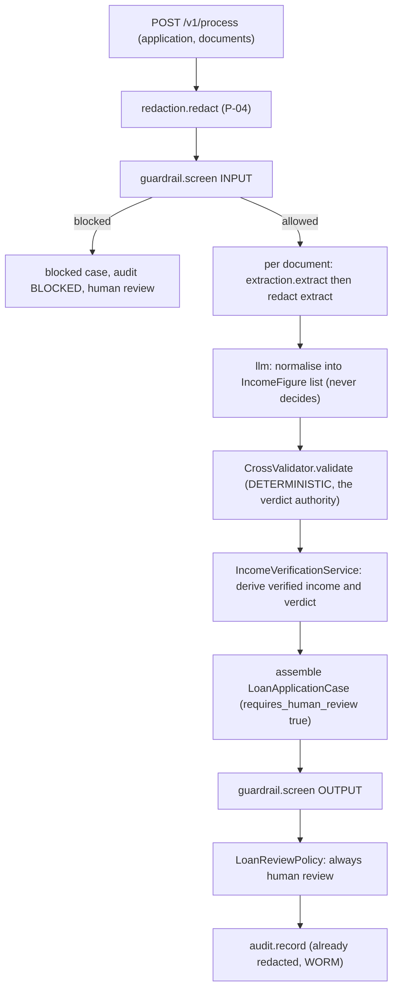
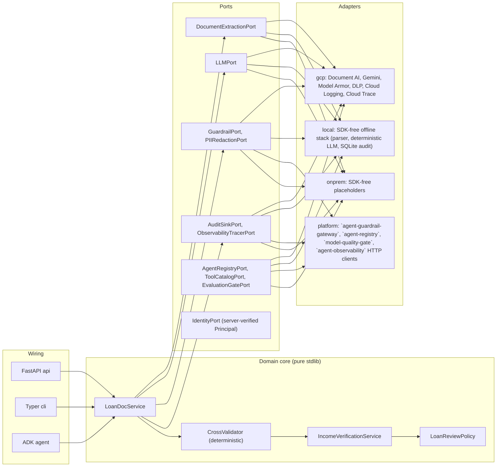

# `loan-document-intelligence` · Loan / Mortgage Document Intelligence (`loan_doc_intel`)

**Industries:** Banking (retail lending), Mortgage lending, Real estate, Fintech / lending, Insurance

A document-intelligence agent for retail-lending underwriting. It extracts income and
bank-statement data from an applicant's documents (Document AI) and runs **deterministic
cross-validation** across them (declared income vs payslip vs bank-statement salary
credits, name/address consistency, balance trend, affordability), producing a cited,
audited, maker-checker-gated income verification.

It is **decision-support for underwriting, not a lending decision**. The agent verifies;
the underwriter decides (P-06). It handles applicant PII (income, bank data), so the full
**R1 redaction + guardrail** pipeline applies.

Built ports-and-adapters on the **Gemini Enterprise Agent Platform** (region
`asia-southeast1`, Singapore), with an offline test+lint gate that runs with **no Google
Cloud SDK installed** : the proof of the no-vendor-lock-in promise.

- Catalog identity: `loan-document-intelligence`, group `doc`, priority **P2**, buyer **Retail Lending**.
- Service port default: **8092**. Python package: `loan_doc_intel`.

## What it produces

| Artifact | Description |
| --- | --- |
| `LoanApplicationCase` | The deliverable: the extracts, the cross-validation result and the income summary. Always `requires_human_review = True`. |
| `CrossValidationResult` | The deterministic consistency checks across documents, each PASS / WARN / FAIL with expected vs observed and field-level evidence. The heart. |
| `IncomeVerificationSummary` | The verified income figure(s), stability, red flags, and a verdict (VERIFIED / NEEDS_REVIEW / INCONSISTENT). |

Every figure is cited to a source document and field, every interaction is written to a
WORM audit log, and the LLM only normalises and explains : it **never** overrides a
deterministic check verdict.

## Pipeline (full R1 safety)



## Architecture (hexagon)



## Quickstart

```bash
/opt/homebrew/bin/python3.14 -m venv .venv && . .venv/bin/activate
pip install -e ".[dev]"          # offline: no Google Cloud SDK
export LOAN_DOC_PROFILE=local     # WORKING offline stack (or gcp / platform / onprem)

ruff check src tests
ruff format --check src tests
pytest -m 'not integration' -q
python eval/run_eval.py
```

The CLI (`loan-document-intelligence`) is import-safe and profile-aware. Under `local` it runs the
whole pipeline offline; under `onprem` the placeholder adapters raise a clean exit-code-2
error naming the migration target.

```bash
loan-document-intelligence --help
loan-document-intelligence validate examples/extracts.json   # deterministic cross-validation
loan-document-intelligence serve --port 8092
```

## Run locally (offline, no Google Cloud)

The `local` profile is a real, SDK-free laptop stack: a local document parser stands in for
Document AI, a deterministic schema-driven generator stands in for Gemini, a regex DLP and a
heuristic guardrail stand in for the safety services, and an append-only SQLite store stands
in for the WORM audit bucket. No API key, no emulator, no `google-cloud-*` package. A small
synthetic application ships in `examples/application.json` (its document ids seed the local
extractor), so one command produces a real, cited income verification:

```bash
export LOAN_DOC_PROFILE=local
loan-document-intelligence process examples/application.json
# -> Verdict: VERIFIED, verified income 6500.0 SGD per monthly, 6 cross-validation checks,
#    each cited to its source document. Always maker-checker gated (P-06).
```

Optional higher-fidelity local development can route the in-process stores to Google's
official emulators when the standard `*_EMULATOR_HOST` env vars are set (e.g.
`FIRESTORE_EMULATOR_HOST`); the google client is imported lazily, only on that branch, so
the default `local` path stays SDK-free. Switching to `onprem` makes the same command fail
fast with exit 2 and the migration message, proving the documented on-prem exit.

## Identity and embedding (secure UI)

Identity is server-verified via an `IdentityPort`: the request body carries no `actor`, and the
audit actor is the verified `Principal`. In `local` mode identity is a seeded dev persona picked
by the `X-Dev-Persona` header (the UI's persona picker, `GET /v1/personas`); in `gcp`/`platform`
mode the backend verifies the Cloud IAP assertion; an unverifiable identity is a `401`. The UI
embeds same-origin under a reverse-proxy sub-path (`NEXT_PUBLIC_BASE_PATH`) with its chrome hidden
(`NEXT_PUBLIC_EMBED=1`), and the backend sets CSP `frame-ancestors` (`LOAN_DOC_FRAME_ANCESTORS`)
and a per-tenant CORS allowlist (`LOAN_DOC_CORS_ORIGINS`, never `"*"`). Full client integration
guide: [`docs/embedding-and-identity.md`](docs/embedding-and-identity.md).

## Dependencies (catalog matrix)

`loan-document-intelligence` consumes the shared platform services: `agent-guardrail-gateway` (R1), `agent-registry` (R4),
`model-quality-gate` AI Quality eval gate at promotion (R5), `agent-observability` (R2), and
`human-review-console` Human Review for maker-checker routing. It is
validated by `architecture-validator` at intake (R6). It does document extraction + deterministic
validation, **not** RAG over a corpus, so **R3 / `enterprise-knowledge-base` is N/A**.

## Profiles

| Profile | Binds to |
| --- | --- |
| `local` (set `LOAN_DOC_PROFILE=local` deliberately; dev / test / CI) | A WORKING offline stack: local document parser, deterministic LLM, regex DLP, heuristic guardrail, append-only SQLite audit, in-process session/memory/registry. SDK-free; runs the whole pipeline on a laptop. Tests and CI run here. With the variable unset the same adapters bind, but as an unconsented run: no seeded personas and no localhost CORS grant. |
| `gcp` (production sets `LOAN_DOC_PROFILE=gcp` explicitly) | Document AI, Gemini, Model Armor, DLP, Cloud Logging WORM, Cloud Trace, Gen AI eval. |
| `platform` | HTTP clients to `agent-guardrail-gateway` / `agent-registry` / `model-quality-gate` / `agent-observability` (the rest fall back to `gcp`). |
| `onprem` | SDK-free fail-fast placeholder adapters (the Google Distributed Cloud migration target): every method raises a clean exit-code-2 error. |

## Layout

```
src/loan_doc_intel/
  domain/      models, cross_validator, income_service, loan_doc_service, hitl, prompts, _grounded
  ports/       extraction, generation, safety, observability, governance, runtime
  adapters/    gcp/  local/  platform/  onprem/
  api/  cli/  agent/
config/settings.yaml      port -> adapter bindings (the build contract)
eval/                     offline credential-free promotion gate
infra/terraform/          asia-southeast1 resources
ui/                       React/Next.js (source only)
```

## Compliance

See `COMPLIANCE.md` for the mapping of General Principles P-01..P-12 and rules R1..R6 to
concrete controls in this repo. `loan-document-intelligence` stresses **P-04** (redact applicant PII before
model/audit), **P-06** (maker-checker: the underwriter decides), and **P-07** (every
figure cited to a source document + WORM audit). Synthetic applicant data is fictional.

## Cost and latency

Size this system's cost and latency with the shared interactive calculator: [**live**](https://portable-genai.github.io/cost-latency-calculator/calc/calculator.html?system=loan-document-intelligence) or the [in-repo page](cost-latency-calculator.html). The engine and the pricing book are maintained once in [cost-latency-calculator](https://github.com/portable-genai/cost-latency-calculator).

## License

Apache-2.0. See `LICENSE`.

## Documentation authority

Precedence is `SPEC.md` > `ARCHITECTURE.md` > `COMPLIANCE.md` > `README.md`. The first
document owns behavior; later documents explain design, evidence, and use without
overriding it.
